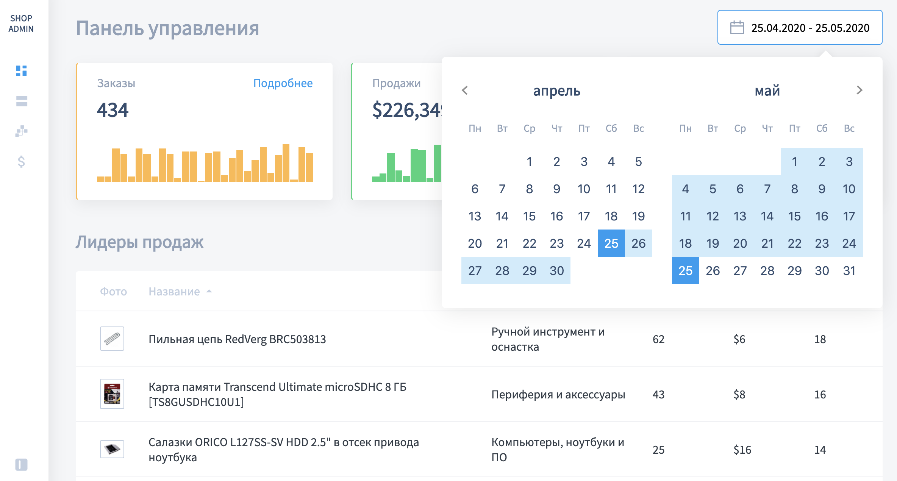

# Admin Dashboard

This project was developed as part of the [JavaScript/DOM/Interfaces course for project programmers](https://learn.javascript.ru/courses/js)
from [learn.javascript.ru](https://learn.javascript.ru/)

A project is a frontend part of a typical "Control Panel" for a merchandise store,
implemented on pure JavaScript and built on a companion architecture

 

 

## Tech stack

